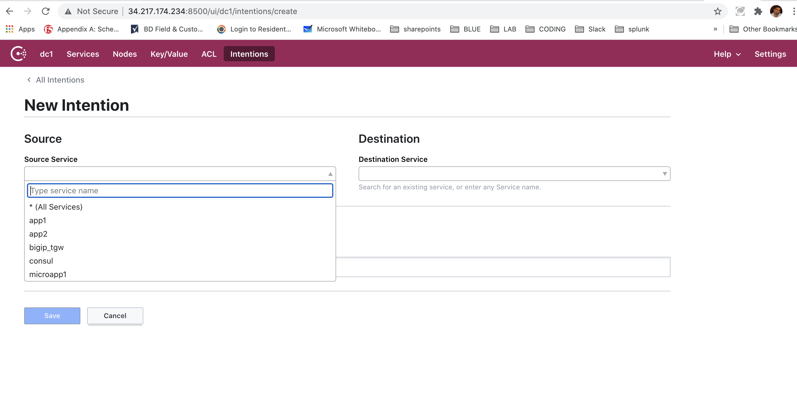
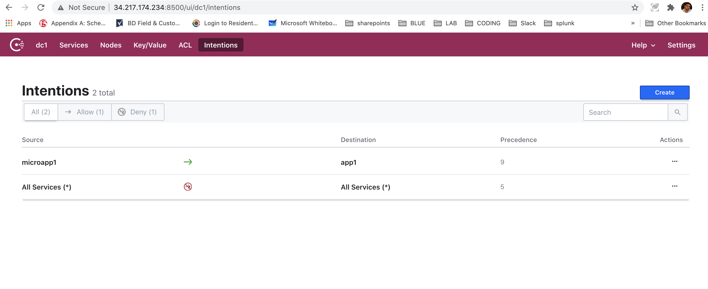
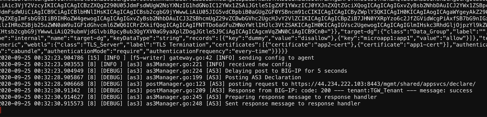

#  Configure Intentions on Consul GUI

1. Goto the Consul UI by issuing http://Consul-IP:8500

2. Click on "Intention" TAB

3. Click on Create Select Source & Destination  as All Services and select Deny

 .. image:: /_static/show.png
 

4. Click on Create --> Source as "microapp1" Destination as "app1" select Allow

 

5. Look at the Watcher code in the terminal, see how the certs & data groups are added.

 

[GoTo Next Excercise](13-ex)

[GoBack](../README.md)
