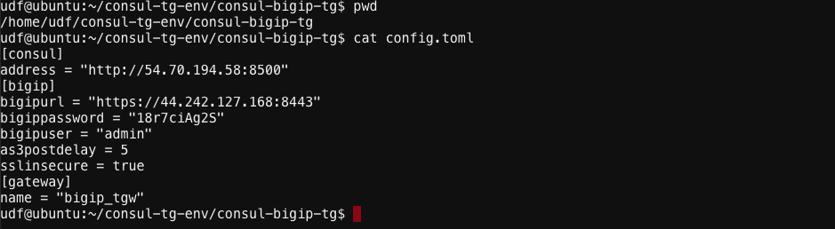
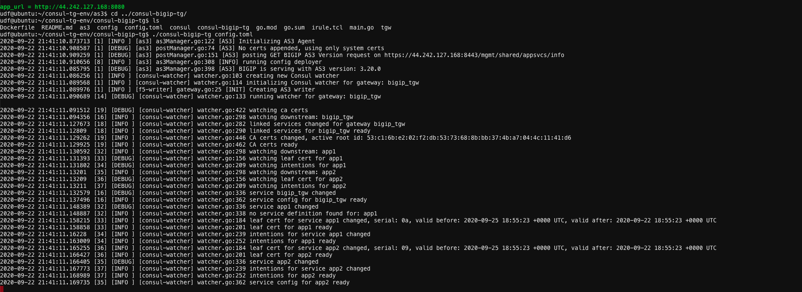
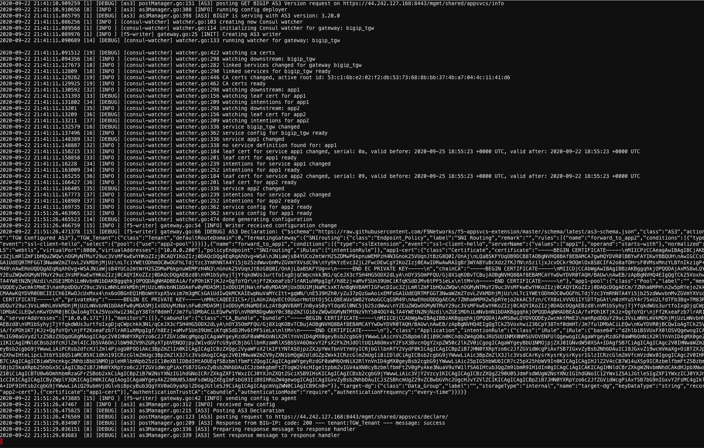

#  Run the Watcher Code


1. Goto the ubuntu WebShell and login to ``udf```

2. Change dir to ```/home/udf/consul-tg-env/consul-bigip-tg``` if not in that dir

Examine the config.tml file

 

3. Execute the binary give parameter as the config.toml file ``` ./consul-bigip-tg config.toml ```


 
 


