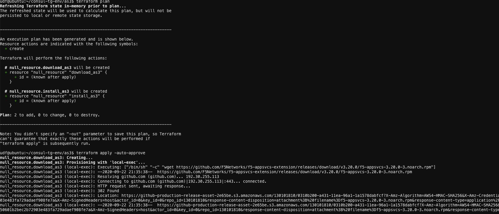

#  Install As3 RPM on BIG-IP

1. Goto the ubuntu WebShell and login to udf

2. Change dir to `/home/udf/consul-tg-env/as3` if not in that dir

3. Remove any previous terraform state file by doing `rm terraform.tfstate`

4. Execute `terraform plan ` & `terraform apply -auto-approve` to install as3

 

