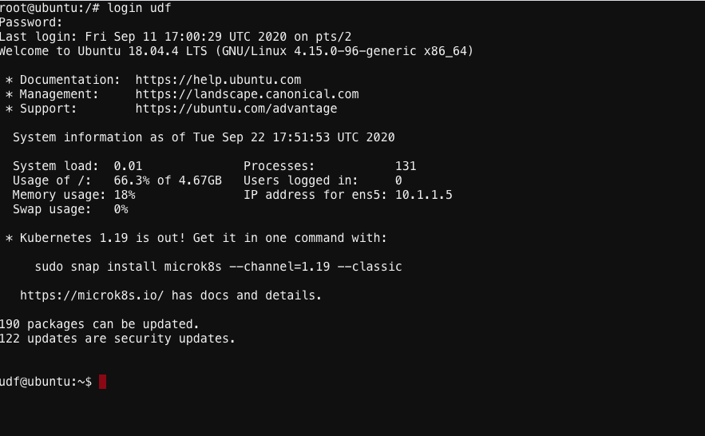

# Lets Enable Envoy Proxy for microapp1 ...

1. Now we need to enable Envoy Side car proxy for microapp1

2. Open another ubuntu WEB Shell from UDF by doing Components–>ubuntu–>Access–>web Shell

 

3. At the prompt enter ``` login udf ``` & Password ``` udf ```


 

4. After logging in udf change directory ```cd consul-tg-env/tffiles```

5. Goto AWS Console –> Services —> EC2 –> scs-term-gw-demo-client –> Actions –> Connect —> ssh client

6. Copy the example as shown and go back to the ubuntu Webshell and paste it as shown


 
 
 

[GoTo Next Exercise-7](7-ex)

[GoBack](../README.md)
