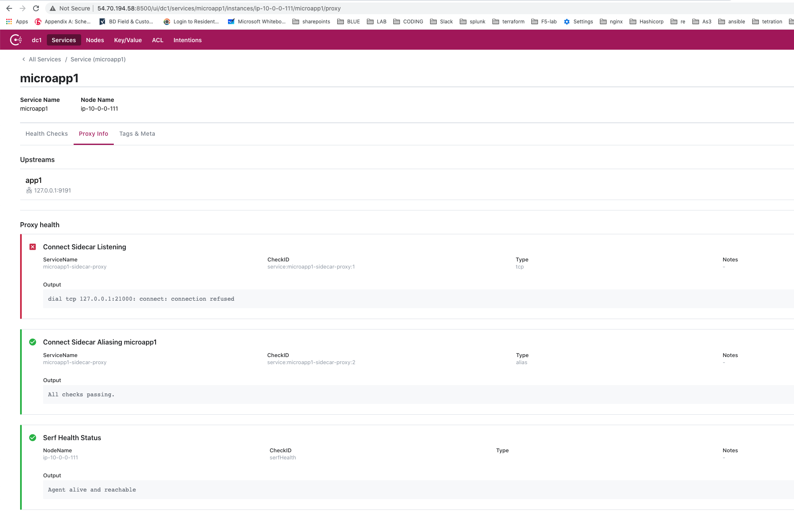

# Check status of Envoy Proxy for microapp

1. Go to the Consul GUI by doing http://consul_ip:8500

2. Click on Services –> microapp1 –> Health Checks –> Proxy info

 

Note

- You can see that the Envoy Side Car proxy is not working 

