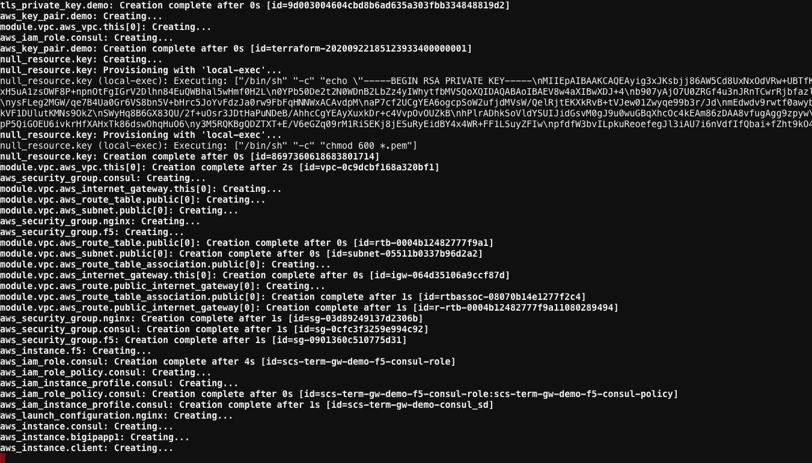
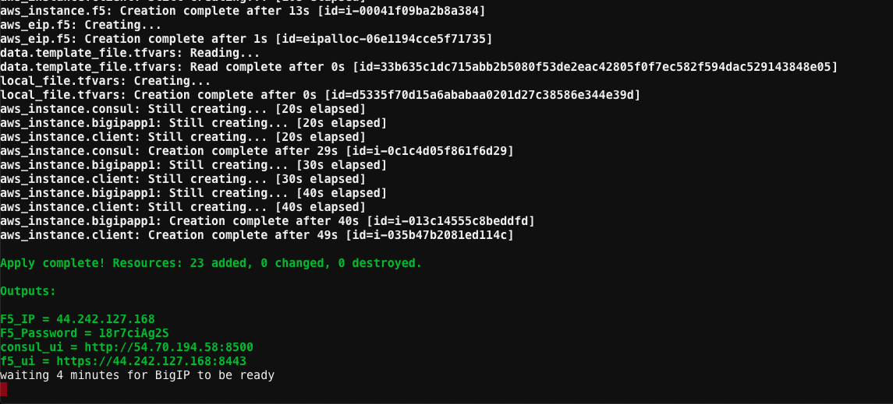
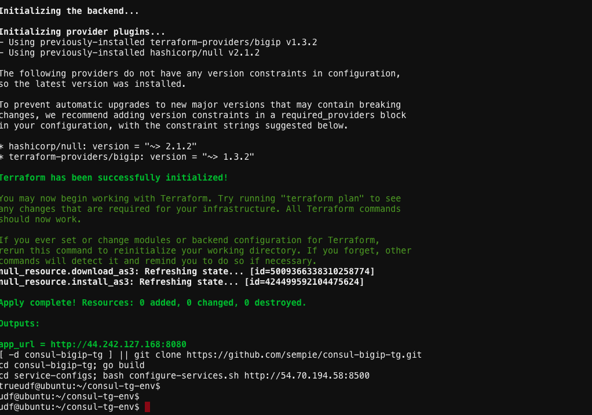

# Run Make File to create Infrastructure

1. Got to ubuntu Web Shell and change directory to ```consul-tg-env```

2. Run ```make all``` This will run terraform and build the infra

 

 

 

3. After about 4 minutes you should have all the instances created on AWS
